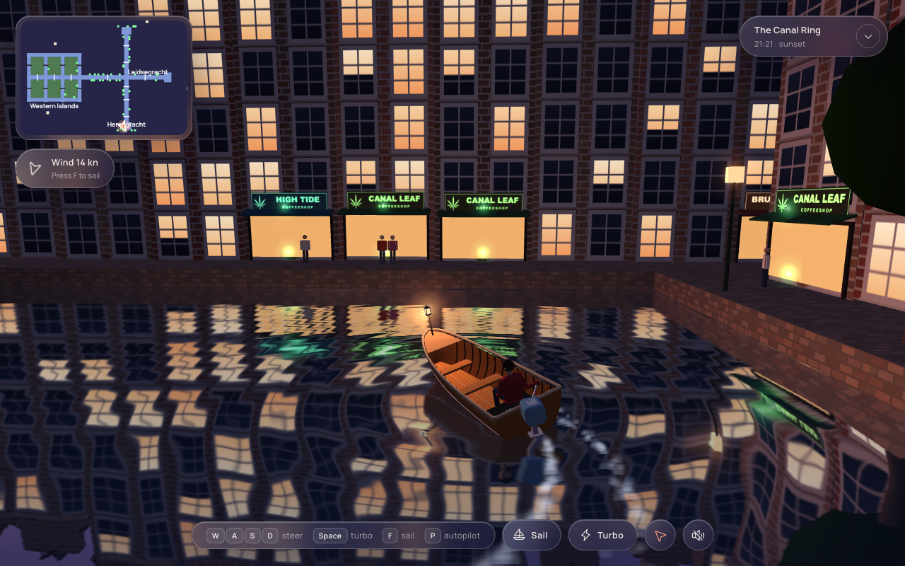
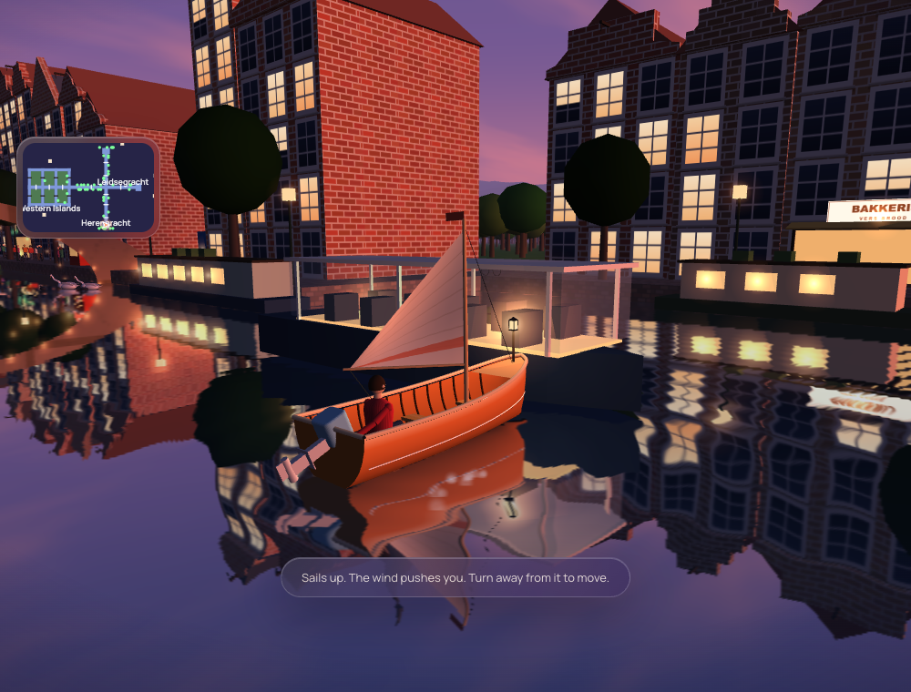
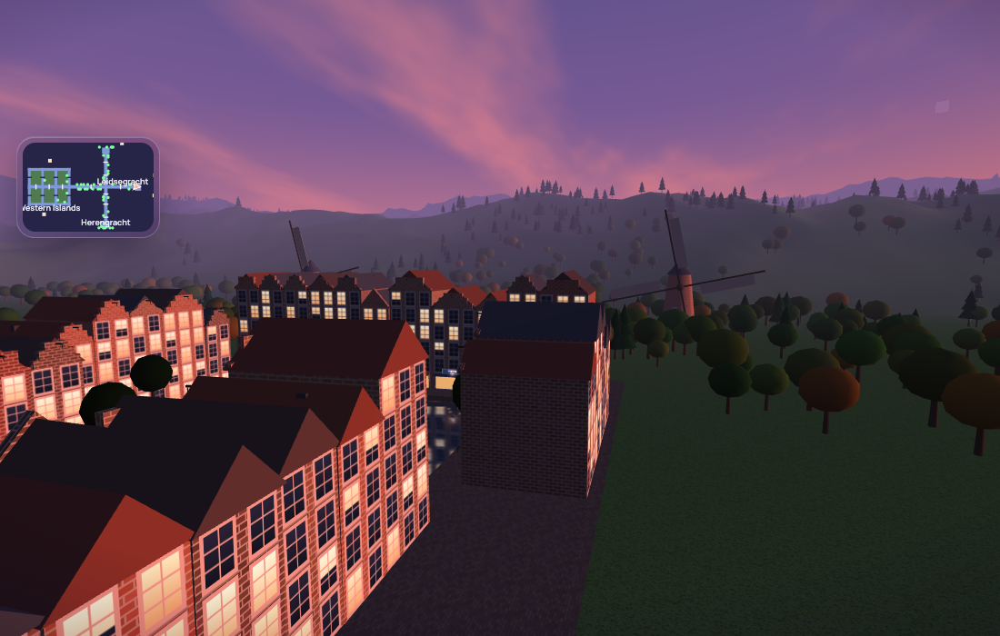
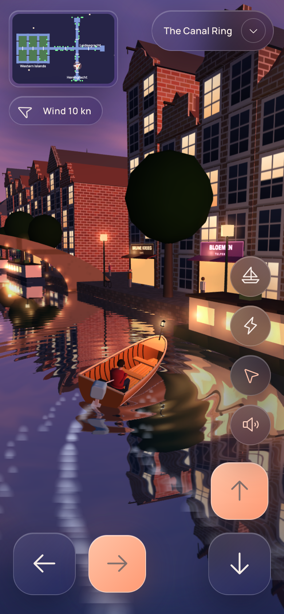
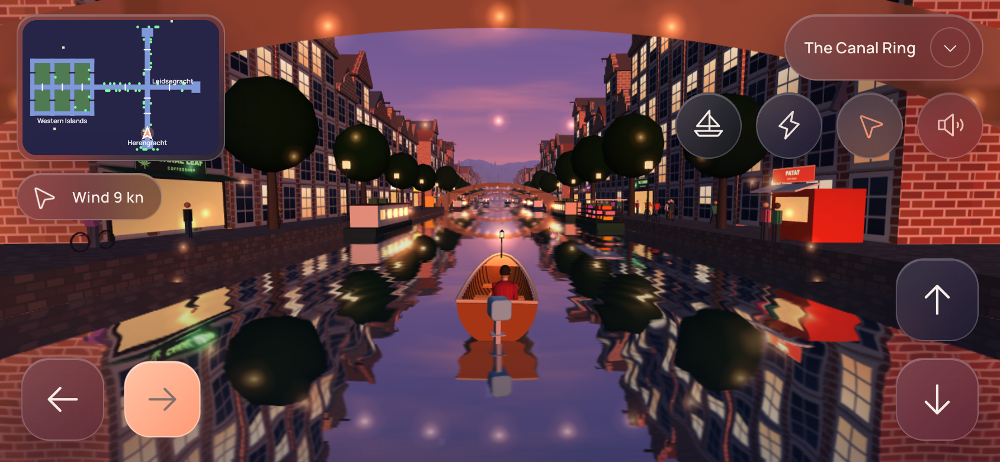

# Amsterdam Canal Ring

A tiny browser game: drive or sail a little wooden boat through the canals of Amsterdam at dusk.

One HTML file. [Three.js](https://threejs.org) from a CDN, no build step, no accounts, no API keys. Everything you see (the houses, boat, swans, trees, hills, textures and sound) is generated by code in `index.html`.



## Features

- **Canal network** with bridges, a crossing, a basin at each end and a small archipelago of green islands (the "Western Islands") with black-and-white drawbridges.
- **Real-time mirror water** (planar reflections), a wake, ripples, and a sunset-to-blue-hour sky you can scrub from the menu.
- **Engine or sail.** Press `F` to put the sails up: a wind with gusts and a sailing polar (you cannot sail straight into the wind; a beam reach is fastest). The houses channel the wind along the canals.
- **Turbo** on `Space`.
- **Solid world.** Head-on hits stop you dead with a small bump back; shallow hits slide along the wall. Reverse to get out.
- **Life on the canals:** swans and ducks that glide, watch you and paddle away; tour boats, trams over the bridges, windmills, walkers and cyclists, houseboats, a flower barge.
- **Shops** along the quays (cafes, cheese, bikes, tulips, fries and coffeeshops) with lit windows and signs.
- **Nature:** rolling hills, forests and meadows around the town.
- **Minimap** with your position, and an **autopilot** that tours the whole network.
- **Phone and tablet controls:** on-screen arrows (steer, go, reverse) and round Sail, Turbo, Autopilot and Sound buttons, laid out for two thumbs in portrait and landscape.

| Under sail | Hills and windmills |
|---|---|
|  |  |

<p>
  
  
</p>

## Controls

| Key | Action |
|---|---|
| `W` `A` `S` `D` / arrows | Steer. `S` reverses (under sail: brake, then push off) |
| `Space` or `T` | Turbo (engine only). Hold `Shift` for a momentary boost |
| `F` | Switch between engine and sails |
| `P` | Autopilot |
| Touch screens | `◀` `▶` steer (left thumb), `▲` go and `▼` reverse (right thumb); round buttons for Sail, Turbo, Autopilot and Sound. Hold several at once |

## Run it

Just open `index.html` in a recent desktop browser (WebGL required). It loads Three.js, icons and fonts from CDNs, so you need an internet connection. To serve it locally:

```bash
python3 -m http.server 8000
# then open http://localhost:8000
```

## Instagram story tooling (optional)

`tools/story-clip/` holds the scripts used to make a 25 second vertical clip of the game:

- `record_story.mjs` plays the game in headless Chrome one frame at a time (deterministic, 1080x1920) with a scripted shot list and key presses. Needs `playwright-core`, Chrome and `ffmpeg`.
- `make_music.py` writes an original 100 BPM soundtrack with NumPy only.
- `mix_audio.py` lays your own sound-effect files over it (`SFX_DIR`; none are included).
- `hf/index.html` is a [HyperFrames](https://hyperframes.heygen.com) composition for the titles, key-cap guide and call to action. It expects `assets/plate.mp4`, `assets/mix.wav` and the Cormorant Garamond and Manrope font files, which are not included.

## Credits and licence

Inspired by a short 3D canal video posted by [@techartist_](https://x.com/techartist_). No assets from that video are used; the game is written from scratch.

Uses [Three.js r128](https://github.com/mrdoob/three.js) (MIT), [Phosphor Icons](https://phosphoricons.com) (MIT) and the Google Fonts Cormorant Garamond and Manrope (SIL OFL), all loaded from CDNs.

Code released under the [MIT licence](LICENSE).
